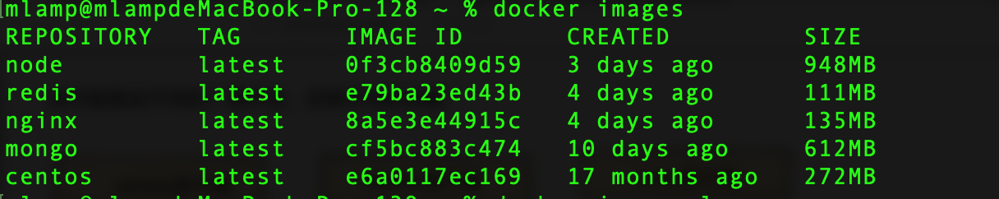
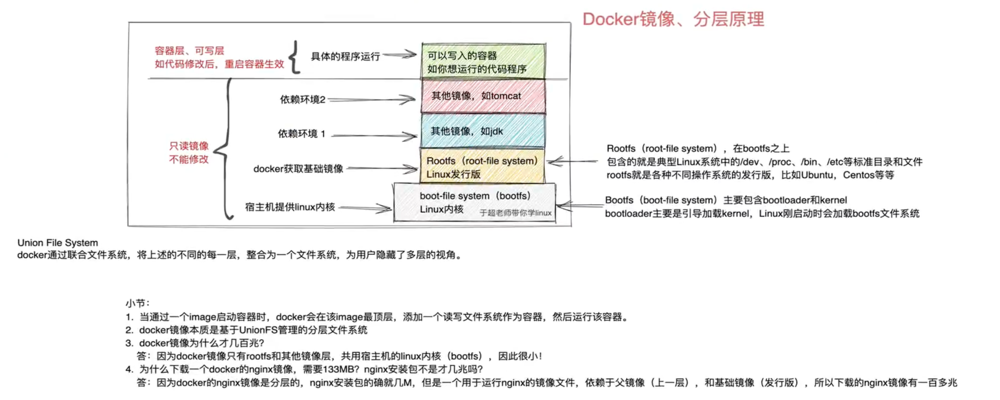
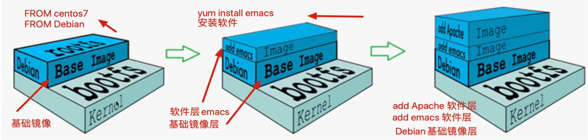
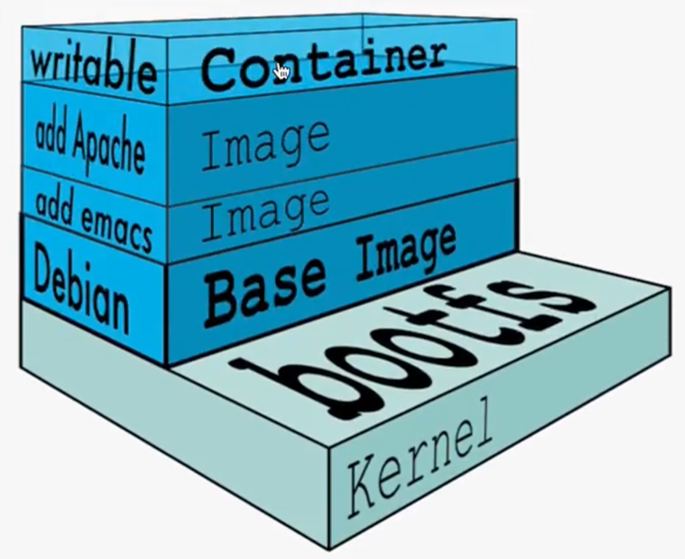
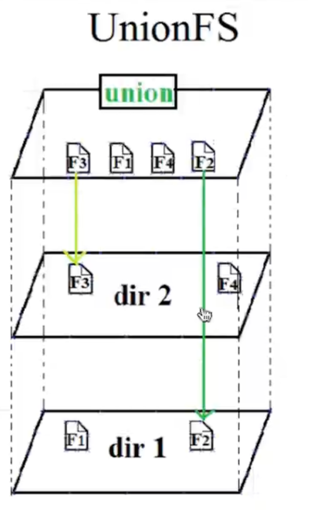

# Docker

## 1. 前言

### 1.1 容器技术

Docker最初是DotCloud公司在法国期间发起的一个公司内部项目, 后来以Apache2.0授权协议开源, 代码在github上维护.

Docker是基于Google公司推出的Golang语言开发而来, 基于Linux内核的Ggroups、NameSpace, 以及Union FS等技术, 对进程进行封装隔离, 属于操作系统层面的虚拟化技术.

由于隔离的进程独立于宿主机和其他隔离的进程, 也被称之为容器.

最初的Docker是基于LXC的, 后来去除LXC转而使用自行开发的Libcontainer. 

Docker被定义为开源的容器引擎, 可以方便的对容器进行管理. 例如: 对镜像打包封装, 引入Docker Registry对镜像进行统一管理.

利用Docker可以实现开发, 测试, 生产环境的部署一致性, 极大地减少运维成本.

### 1.2 容器和虚拟化的差异

#### 1.2.1 传统虚拟化技术

虚拟机是虚拟出一套硬件, 在其上面运行一个完整的操作系统, 例如KVM, vmware, 指定系统镜像, 然后装系统, 最终可以使用, 在该系统上在运行所需的应用程序.


#### 1.2.2 容器技术

容器内的应用程序直接进行在宿主机的内核上, 容器内没有自己的内核, 也没有对硬件进行虚拟, 因此容器比虚拟机更为轻便.


### 1.3 容器对比KVM的好处

- 容器能够提供宿主机的性能, 而kvm虚拟机是分配宿主机硬件资源, 性能较弱;
- 同样配置的宿主机, 最多可以启动10个虚拟机的话, 可以启动100+的容器数量;
- 启动一个kvm虚拟机, 得有一个完整的开机流程, 花费时间较长, 或许的20s, 而启动一个容器只需要1s;
- kvm需要硬件CPU的虚拟化支持, 而容器不需要.

### 1.4 为什么选择Docker

#### 1.4.1 docker更高效的利用系统资源

​		容器不需要进行硬件虚拟化以及运行一个完整操作系统的额外开销, docker对系统资源的利用率更高, 无论是应用执行, 文件存储, 还是在内存消耗等方面, 都比传统虚拟机更高效. 因此一个同样配置的主机, 可以运行更多数量的容器实例.

#### 1.4.2 更快的启动时间

​		传统的虚拟机启动时间较长, docker容器直接运行在宿主机的内核上, 无须启动一个完整的操作系统, 因此可以达到秒级启动, 大大的解决开发, 测试, 部署的时间.

####  1.4.3 一致性的环境

​		在企业里, 程序从开发环境, 到测试环境, 到生产环境, 难以保证及其环境一致性, 极大可能出现系统依赖冲突, 导致难以部署等BUG.

​		然而利用docker的容器-镜像技术, 提供了除了内核以外完整的运行时环境 , 确保了应用环境的一致性.

#### 1.4.4 持续交付和部署

​		还是刚才所说的一致性的环境, 对于开发和运维人员, 最希望的就是环境部署迁移别出问题, 利用docker可以定制惊醒, 以达到持续集成, 持续交付和部署.

通过Dockerfile来进行镜像构建, 实现系统集成测试, 运维进行生产环境的部署.

且Dockerfile可以使镜像构建透明化, 方便技术团队能够快速理解运行环境部署流程.

#### 1.4.5 更轻松的迁移

​		Docker可以在很多平台运行, 无论是物理机, 虚拟机, 云服务器等环境, 运行结果都是一致的. 用于可以轻松的讲一个平台的应用, 迁移到另一个平台, 而不用担心环境的变化, 导致程序无法运行.

#### 1.4.6 docker能做什么

- 可以把应用程序代码及运行依赖环境打包成镜像, 作为交付介质, 在各个环境部署
- 可以将镜像(image)启动成为容器(container), 并提供多容器的生命周期进行管理(启、停、删)
- container容器之间相互隔离, 且每个容器可以设置资源限额
- 提供轻量级虚拟化功能, 容器就是在宿主机中的一个个的虚拟的空间, 彼此相互隔离, 完全独立

### 1.5 Docker VS 传统虚拟机

| 特性       | 容器               | 虚拟机     |
| ---------- | ------------------ | ---------- |
| 启动       | 秒级               | 分钟级     |
| 硬盘使用   | 一般为MB           | 一般为GB   |
| 性能       | 接近原生           | 弱         |
| 系统支持量 | 单机支持上千个容器 | 一般几十个 |

## 2. Docker安装部署

查看[官方文档](https://docs.docker.com/engine/install/)

## 3. Docker 引擎


### 3.1 Docker Daemon

安装使用docker, 得先运行Docker Daemon进程, 用于管理docker, 如:

- 镜像 images
- 容器 container
- 网络 network
- 数据卷 Data Volumes

### 3.2 rest接口

​		提供和Daemon交互的API接口

### 3.3 Docker Client

​		客户端使用REST API和Docker Daemon进行访问.

### 3.4 Images

镜像是一个只读模版, 用于创建容器, 也可以通过Dockerfile文件描述镜像的内容. 镜像的概念类似于编程开发里面面对对象的类, 从一个基础类(基础镜像 Base Image)构建容器的过程, 就是运行镜像, 生成容器.

Docker镜像的描述文件是Dockerfile, 包含了如下的指定

- FROM 					定义基础镜像
- MAINTAINER 		作者
- RUN 					   运行Linux命令
- ADD					    添加文件/目录
- ENV                         环境变量
- CMD                       运行进程

### 3.5 Container

容器是一个镜像的运行实例, 镜像 => 容器.

创建容器的过程

- 获取镜像, 如`docker pull centos`, 从镜像仓库拉取
- 使用镜像创建容器
- 分配文件系统, 挂载一个读写层, 在读写层加载镜像
- 分配网络/网桥接口, 创建一个网络接口, 让容器和宿主机通信
- 容器获取IP地址
- 执行容器命令, 如`/bin/bash`
- 反馈容器启动结果

### 3.6 Registry

​		Docker镜像需要进行管理, docker提供了Registry仓库, 其实它也是一个容器. 可以用于可以基于该容器运行私有仓库.

​		可以使用Docker Hub互联网公共镜像仓库.

### 3.7 Docker平台组成


## 4. Docker 生命周期

学习docker的核心要素: ==镜像image==、==容器container==!


## 5. Docker 镜像

### 5.1 Docker镜像原理


```shell
mlamp@mlampdeMacBook-Pro-128 ~ % docker pull redis
Using default tag: latest
latest: Pulling from library/redis
5731adb3a4ab: Pull complete 
e78ad00da4bd: Pull complete 
acf81d284940: Pull complete 
c19f7ed7779d: Pull complete 
9df49c3f82f2: Pull complete 
cf4fe2915070: Pull complete 
Digest: sha256:6a59f1cbb8d28ac484176d52c473494859a512ddba3ea62a547258cf16c9b3ae
Status: Downloaded newer image for redis:latest
docker.io/library/redis:latest
```

1. 一个完整的docker镜像可以创建出docker容器	

   

docker的架构, 镜像就是第一个***发行版***的作用. 你需要准备好一个linux内核, 然后上层使用不同的***发行版***就好了, 这样你可以自由的使用各种版本系统, 兼容多种环境.



docker镜像不包含linux内核, 和宿主机公用.

#### 5.1.1 docker镜像定义

我们如果想要安装一个mysql5.6镜像, 我们会这么做

- 获取基础镜像, 选择一个发型版本(ubutu, centos)
- 在centos镜像中安装mysql5.6软件

导出镜像, 可以命名为mysql:5.6镜像文件.

从这个过程, 我们可以感觉这是一层一层添加的, docker镜像的层级概念就出来了, 底层是centos镜像, 上层是mysql镜像, centos镜像层属于父镜像.



Docker镜像是在基础镜像之后, 然后安装软件, 配置软件, 添加新的层, 构建出来.

这种现象在学习dockerfile构建时候, 更为清晰.

#### 5.1.2 docker为什么分层镜像

镜像分享一大好处就是资源共享, 例如有多个镜像都来自于同一个base镜像, 那么docker host只需要存储一份base镜像.

内存里也只需要加载一份host, 即可为多个容器服务.

即使多个容器共享一个base镜像, 某个容器修改了host镜像的内容, 例如修改/etc/下的配置文件, 其他容器的/etc/下内容是不会被修改的, 修改动作只限制在单个容器内, 这就是容器的写入时复制特性(Copy-on-Write).

#### 5.1.3 可写的容器层

当容器启动后, 一个新的可写层被加载到镜像的顶部, 这一层通常被称为**容器层**, **容器层**下的都称为**镜像层**.



> 所有对容器的修改动作, 都只会发生在**容器层**, 只有**容器层**是可写的, 其余**镜像层**都是只读的.

| 文件操作     | 说明                                                         |
| :----------- | ------------------------------------------------------------ |
| **添加文件** | 在容器中创建文件时, 新文件被添加到容器层中.                  |
| **读取文件** | 在容器中读取某个文件时, Docker会从上往下依次在各个镜像中查找此文件. 一旦找到, 立即将其复制到容器层, 然后打开并读入内存. |
| **修改文件** | 在容器中修改已存在的文件时, Docker会自上而下依次在各个镜像层中查找此文件. 一旦找到, 立即将其复制到容器层, 然后修改. |
| **删除文件** | 在容器中删除文件时, Docker也是自上而下依次在各个镜像中查找此文件. 找到后, 会在容器层中**记录下此删除操作**.(只是记录删除操作.) |

只有当需要修改时, 才复制一份数据, 这种特性被称为**Copy-on-Write**. 可见, 容器层保存的是镜像变化的部分, 不会对镜像本身进行任何操作.

这样就解释了我们前面提出的问题: 容器层记录对镜像的修改, 所有镜像层都是只读的, 不会被镜像修改, 所以镜像可以被多个容器共享.

#### 5.1.4 Docker镜像的内容

docker镜像层级管理的方式大大便捷了Docker镜像的分发和存储. Docker hub是为全世界的镜像仓库.

- Docker镜像代表一个容器的文件系统内容
- 镜像层技术属于**联合文件系统**
- 容器是一个动态的环境, 每一层镜像里的文件都属于镜像内容
  - dockerfile里的ENV、VOLUME、CMD等内容都会落实到容器环境里

#### 5.1.5 UnionFS(联合文件系统)



### 5.2 Docker镜像的实操

#### 5.2.1 获取镜像

##### 5.2.1.1 从dockerhub上获取

[dockerhub](https://hub.docker.com/)

```shell
# 查看centos 7.8版本 镜像
docker search centos:7.8

# 下载centos7.8镜像
docker pull centos:7.8

# 查看本地镜像
docker images # docker image ls

# 查看docker服务的信息
docker info |grep Root

# 运行容器, 生成镜像
# -it 开启一个交互式的终端 --rm 容器退出时删除该容器 centos 镜像名  bash 执行什么命令
docker run -it --rm centos bash
```

##### 5.2.1.2 本地镜像导入导出

```shell
# 导出镜像
docker image save redis > /Users/mlamp/redis.tar.gz

# 导入镜像
docker image load redis -i /Users/mlamp/redis.tar.gz
```

##### 5.2.1.3 私有的docker仓库

#### 5.2.2 查看镜像

```shell
# 查看镜像
docker images

docker images centos

docker images centos:7.8

# -q ==> --quiet 只列出id
docker images centos:7.8 -q

# 格式化
docker images --format "{{.ID}}--{{.Repository}}"
docker images --format "table {{.ID}}\t{{.Repository}}\t{{.Tag}}"
```

```shell
# 搜索docker镜像
docker search centos:7.8.2003
```

#### 5.2.3 删除镜像

```shell
# 删除镜像 根据id, 名字, 摘要等
docker rmi hello-world
docker rmi 46331d942d63

# 删除镜像
docker rm 62e1d156dd02
```

#### 5.2.4 镜像管理

```shell
# 批量删除镜像
docker rmi `docker images -aq`

# 批量删除容器
docker rm `docker ps -aq`

# 导出镜像
docker image save redis > /Users/mlamp/redis.tar.gz

# 导入镜像
docker image load redis -i /Users/mlamp/redis.tar.gz

# 查看镜像详细信息
docker image inspect id
```

## 6. Docker容器

`docker run` 等于创建+启动

> docker run 镜像名, 如果镜像不存在本地, 则会在线去下载该镜像

**注意: 容器内的进程必须处于当前运行状态, 否则容器会直接退出**

如果容器内, 什么事也没做, 容器也会挂掉, 容器内, 必须有一个进程在前台运行

```shell
# 1. 运行一个挂掉的容器, 会产生多个独立的容器记录, 且容器内没有进程在跑, 因此挂了
docker run centos:7.8.2003

# 2. 运行容器, 且进入容器内, 且在容器内执行某个操作
docker run -it centos bash

# 3. 开启一个容器, 让它帮你运行某个程序
docker run -it centos ping baidu.com

# 4. 运行一个活着的容器, docker ps 可以看到的容器
docker run -d centos # 后台运行centos, 但是centos容器内什么事也没做(容器内没有一个进程在运行)

# 5. 丰富docker运行参数
# -d 后台运行
# --rm 容器挂掉后自动被删除
# --name 容器名
docker run -d --rm --name centos centos ping baidu.com
```

```shell
# 6. 查看日志
docker logs 容器id

# -f 控制台实时查看日志
docker logs -f 容器id

# -n 显示日志条数
docker logs -n 10 容器id
# -t 显示日志时间
docker logs -t 容器id
```

```shell
# 7. 进入正在运行容器空间内
docker exec -it 容器id bash
```

```shell
# 8. 查看容器的详细信息
docker container inspect 容器id
```

```shell
# 9. 容器的端口映射
docker run -d --name docker_nginx_80 -p 80:80 nginx

# 9.1 查看容器的端口转发情况
docker port 容器id

# 9.2 随机端口映射
# -P 随机访问一个宿主机的空闲端口, 映射到容器内打开的端口
docker run -d --name docker_nginx_random -P nginx
```

```shell
# 10. 容器的提交
# 新的镜像名规则: dockerhub账号/镜像名
docker commit 容器id 新的镜像名
```

## 7. DockerFile

### 7.1 dockerfile简介

镜像是多层存储, 每一层在前一层的基础上进行修改;

容器也是多层存储的, 以镜像为基础层, 在其基础上加一层作为容器运行时的存储层.

dockerfile主要组成部分:

> 基础镜像信息 FROM centos:6.8
>
> 制作镜像操作指令 RUN yum install openssh-server -y
>
> 容器启动时执行指令 CMD ["/bin/bash"]

### 7.2 dockerfile指令

| 指令       | 说明                                             | 用法                                                         |
| ---------- | ------------------------------------------------ | ------------------------------------------------------------ |
| FROM       | 指定基础镜像                                     |                                                              |
| MAINTAINER | 指定维护者信息, 可以没有                         |                                                              |
| RUN        | 在命令前加RUN即可                                |                                                              |
| ADD        | COPY文件, 会自动解压(添加宿主机的文件到容器内)   | 特性和`COPY`基本一致, 不过多了些功能<br />1. 源文件是一个URL, 此时docker引擎会下载该链接, 放入目标路径, 且权限自动设为600, 若这不是期望结构, 还可得加一层`RUN`指令进行调整<br />2. 源文件是一个URL, 且是一个压缩包, 不会自动解压, 也得单独用`RUN`指令解压<br />3. 源文件是一个压缩文件, 且是gzip,bzip2,xz,tar情况, `ADD`指令会自动解压该文件到目标路径 |
| WORKDIR    | 设置当前工作目录, 相当于`cd`                     |                                                              |
| VOLUME     | 设置卷, 挂载主机目录                             |                                                              |
| EXPOSE     | 指定对外的端口                                   |                                                              |
| CMD        | 指镜像在运行容器实例的时候, 执行的具体参数是什么 | 用法, **注意用双引号**<br />`CMD ["参数1", "参数2"]`<br />在制定了`ENTRYPOINT`指令后, 用`CMD`指定具体的参数 |

- FROM

dockerfile其他指令

| 指令       | 说明                                                         | 用法                                                         |
| :--------- | ------------------------------------------------------------ | ------------------------------------------------------------ |
| COPY       | 复制文件(添加宿主机的文件到容器内, 没有自动解压操作) <br />**copy指令能够保留源文件的元数据, 如权限,访问时间等等** | `COPY xx.txt /home/`<br />`COPY /*/xx.txt /tmp/cc?.txt /home/` |
| ENV        | 环境变量                                                     |                                                              |
| ENTRYPOINT | 容器启动后执行的命令                                         | 和`RUN`命令一样, 分为两种<br />exec和shell<br />作用`CMD`一样, 都是在指定容器启动程序以及参数<br />当指定了`ENTRYPOINT`之后, `CMD`指令的语义发生变化, 而是把`CMD`的内容当参数传递给`ENTRYPOINT`指令. |

- ENV 和 ARG指令

  

> Dockerfile官方更为推荐使用`COPY`, `ADD`包含了更多复杂的功能, 且`ADD`会使构建缓存失效, 导致构建缓慢.

### 7.3 快速入门dockerfile

1. 编写Dockerfile文件
2. 生成镜像 `docker build .`
3. 修改镜像名 `docker tag 镜像id 镜像名


